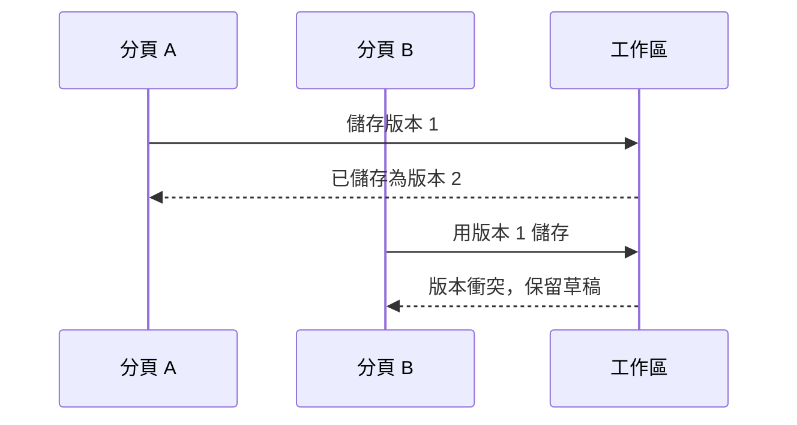

# 儲存衝突與草稿救回

兩個分頁可以開啟同一份文件。同步編輯時，較舊的版本不能悄悄覆寫新的內容。

## 同一份文件，兩個分頁

```mermaid
sequenceDiagram
    participant A as 分頁 A
    participant B as 分頁 B
    participant DB as 工作區
    A->>DB: 儲存版本 1
    DB-->>A: 已儲存為版本 2
    B->>DB: 用版本 1 儲存
    DB-->>B: 版本衝突，保留草稿
```

## 發生衝突時

1. 下載目前的 Markdown，或另存為新文件。
2. 開啟工作區最新版本，比對後再合併內容。
